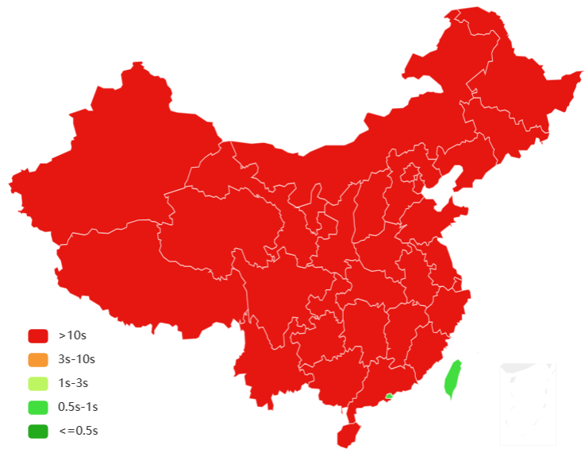
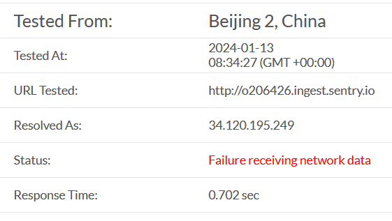
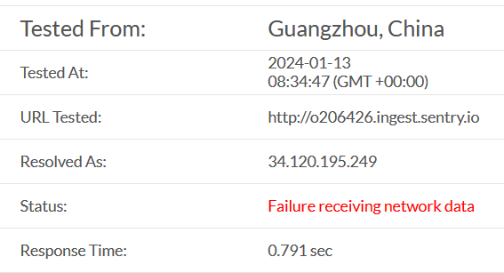
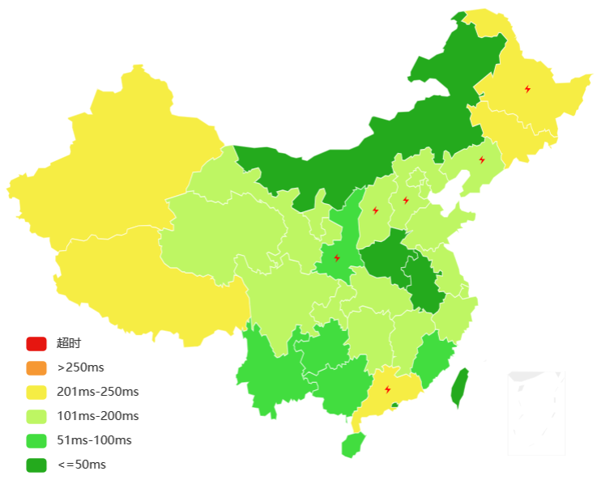
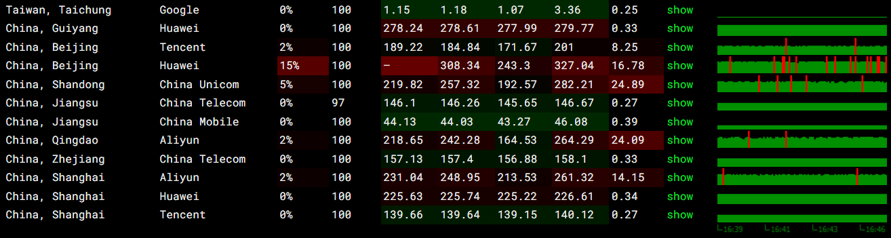

# [Sentry](https://sentry.io/)
[GitHub](https://github.com/getsentry/sentry), [Documentation](https://docs.sentry.io/)

[Expected Features](https://develop.sentry.dev/sdk/features/)

Sentry 在应用 shutdown 时会进行 flush，默认 timeout 为 2s，可能会导致网络环境较差的用户的 error 丢失。

## Availability
Sentry 的 API 至少在中国部分地区的 ISP 下被墙，或完全无法访问，或时好时坏，或访问缓慢，会超过默认的 2s 上传超时：
- HTTP

  `sentry.io`:

  

  `*.ingest.sentry.io`:

  

  

- ping

  

  

[如何解决国内无法使用 Sentry 的问题？ - V2EX](https://www.v2ex.com/t/941564)

## [Pricing](https://sentry.io/pricing/)
Quota | Developer | Team
--- | --- | ---
Monthly errors for Error Monitoring | 5K | 50K
Monthly performance units for Performance Monitoring & Profiling | 10K | 100K
Monthly replays for Session Replay | 50 | 500
Monthly replays for Session Replay | 1GB | 1GB

## Users
- User identification is disabled by default (except on JavaScript).
- [.NET](https://docs.sentry.io/platforms/dotnet/enriching-events/identify-user/)
  - \> 3.29, 4.9: `installationId` as user ID and report IP by default
  - `IsGlobalModeEnabled`: Specifies whether to use global scope management mode. Should be `true` for client applications and `false` for server applications. The default is `false`. The default for Blazor WASM, MAUI, and Mobile apps is `true`, *but not for WPF apps*.
- [Rust](https://docs.sentry.io/platforms/rust/enriching-events/identify-user/): Sentry will capture `server_name` by default, but it is not used to identify the users.

  ```rust
  let _guard = sentry::init(...);
  let server_name = _guard.options().server_name.as_ref().map(|s| s.to_string());
  sentry::configure_scope(move |scope| {
      scope.set_user(Some(sentry::User {
          username: server_name,
          ..Default::default()
      }));
  });
  ```

## Release health
[Crash-free Sessions, Carefree Users with Release Health | Product Blog - Sentry](https://blog.sentry.io/crash-free-sessions-carefree-users-with-release-health/)

- Session status: `Healthy` (`Exited`), `Errored`, `Abnormal`, `Crashed`
  - `Errored` includes `Critical` errors

- `Crash Free Sessions` 和 `Crash Free Users` 滞后于图表。

- [.NET](https://docs.sentry.io/platforms/dotnet/configuration/releases/#sessions)

  Disabled by default in the current version.

  - Auto session's user can neither be configuared as in Rust, but there is auto user ID.
  - [Crash Free rate in MAUI seems broken - Issue #2551](https://github.com/getsentry/sentry-dotnet/issues/2551)

    3.35.1~3.41.2, 4.0.0-beta.0

  - [`GlobalSessionManager.cs`](https://github.com/getsentry/sentry-dotnet/blob/6ea8ce3756acff0c8e24b9bb853bd883ea9e696b/src/Sentry/GlobalSessionManager.cs)
  - `UnhandledException`
    - [`SentryClient.cs`](https://github.com/getsentry/sentry-dotnet/blob/6ea8ce3756acff0c8e24b9bb853bd883ea9e696b/src/Sentry/SentryClient.cs#L334-L346)
    - `HasTerminalException() => !handled && mechanism != UnobservedTaskExceptionIntegration`

- [Rust](https://docs.sentry.io/platforms/rust/configuration/releases/)

  ```rust
  let guard = sentry::init(sentry::ClientOptions {
      // Auto session's user is broken
      auto_session_tracking: false,
      ..Default::default()
  });

  // Sentry will capture `server_name` by default, but it is not used to identify the users.
  // User can only be configured after `init()`.
  let server_name = guard.options().server_name.as_ref().map(|s| s.to_string());
  sentry::configure_scope(move |scope| {
      scope.set_user(Some(sentry::User {
          username: server_name,
          ..Default::default()
      }));
  });

  sentry::start_session();
  ```
  [fix: Propagate User updates to the active Session by Swatinem - Pull Request #292 - getsentry/sentry-rust](https://github.com/getsentry/sentry-rust/pull/292)

[What is an acceptable crash-free session and crash-free user rate? : r/vuejs](https://www.reddit.com/r/vuejs/comments/xq60n1/what_is_an_acceptable_crashfree_session_and/)

## Platforms
### [CLI](https://github.com/getsentry/sentry-cli)
- [CLI reports that an event is sent even if it isn't - Issue #350 - getsentry/sentry-cli](https://github.com/getsentry/sentry-cli/issues/350)

  `send-event` will always print the event ID even the event is not sent successfully.

### [Rust](https://docs.sentry.io/platforms/rust/)
[GitHub](https://github.com/getsentry/sentry-rust/tree/master/sentry)

> The Rust SDK does not offer means to detect whether an Event has sent successfully or not.

- `[sentry] Failed to send envelope: error sending request for url (https://*.ingest.sentry.io/api/*/envelope/): error trying to connect: unexpected EOF during handshake`

Integrations:
- [log](https://docs.rs/sentry-log/0.31.3/sentry_log/)
- [tracing](https://docs.rs/sentry-tracing/latest/sentry_tracing/index.html)
  - `Rust Tracing Location`
  - `Rust Tracing Fields`

    Events with fields of different values but the same message will be grouped together.
- [tower](https://crates.io/crates/sentry-tower)

### .NET
[GitHub](https://github.com/getsentry/sentry-dotnet)

- NLog
  - Trace, Debug → Debug
  - Info → Info
  - Warn → Warning
  - Error → Error
  - Fatal → Critical

- [Shutdown and Draining | Sentry for Dotnet](https://docs.sentry.io/platforms/dotnet/configuration/draining/)

- [Integrations/AppDomainUnhandledExceptionIntegration.cs](https://github.com/getsentry/sentry-dotnet/blob/6ea8ce3756acff0c8e24b9bb853bd883ea9e696b/src/Sentry/Integrations/AppDomainUnhandledExceptionIntegration.cs)

## [Debug Information Files](https://docs.sentry.io/platforms/native/data-management/debug-files/)
```sh
sentry-cli debug-files upload -o <org> -p <project> --wait /path/to/files...
```

Sentry 只会自动解析上传 debug information files 之后报告的 event，解决方法有两个：
- 开启 [Early Adopter](https://docs.sentry.io/product/accounts/early-adopter-features/) 加入内测后可以启用 [Reprocessing](https://docs.sentry.io/product/issues/reprocessing/) 功能，可以在上传 debug information files 后手动对未解析的 event 进行应用。
- 开启 [Legacy Reprocessing](https://docs.sentry.io/product/issues/reprocessing/#legacy-reprocessing) 可以在不能解析 event 时暂停处理并进行警告。

