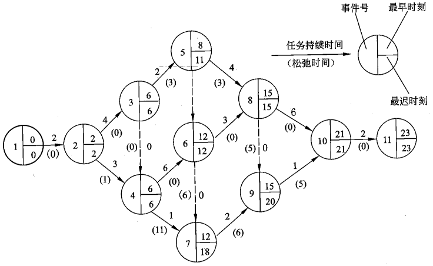

# [Program Evaluation and Review Technique](https://en.wikipedia.org/wiki/Program_evaluation_and_review_technique)

PERT supplies a number of tools for management with determination of concepts, such as:

- [float](https://en.wikipedia.org/wiki/Float_(project_management)) or [slack](https://en.wikipedia.org/wiki/Float_(project_management)) is a measure of the excess time and resources available to complete a task. It is the amount of time that a project task can be delayed without causing a delay in any subsequent tasks (_free float_) or the whole project (_total float_). Positive slack would indicate _ahead of schedule_; negative slack would indicate _behind schedule_; and zero slack would indicate _on schedule_.

  Slack 是 late finish time - early finish time，或 late start time - early start time。
- [critical path](https://en.wikipedia.org/wiki/Critical_path_method): the longest possible continuous pathway taken from the initial event to the terminal event. It determines the total calendar time required for the project; and, therefore, any time delays along the critical path will delay the reaching of the terminal event by at least the same amount.
- critical activity: An activity that has total float equal to zero. An activity with zero free float is not necessarily on the critical path since its path may not be the longest.
- [lead](https://en.wiktionary.org/wiki/lead#Verb_2) time: the time by which a _predecessor event_ must be completed in order to allow sufficient time for the activities that must elapse before a specific PERT event reaches completion.
- lag time: the earliest time by which a _successor event_ can follow a specific PERT event.
- [fast tracking](https://en.wikipedia.org/wiki/Critical_path_method): performing more critical activities in parallel
- [crashing critical path](https://en.wikipedia.org/wiki/Critical_path_method): Shortening duration of critical activities