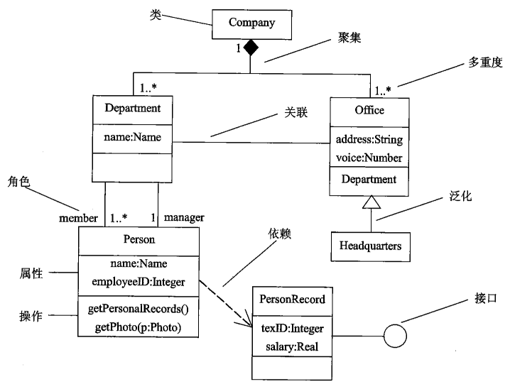
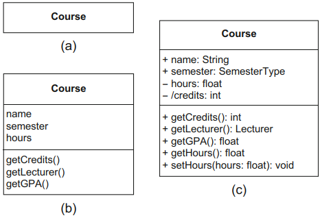
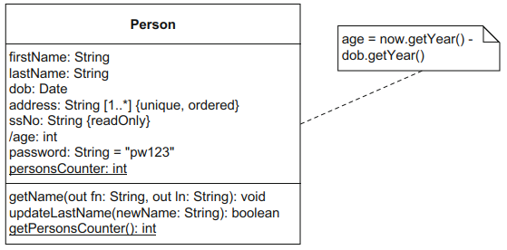
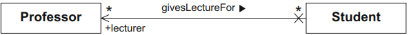
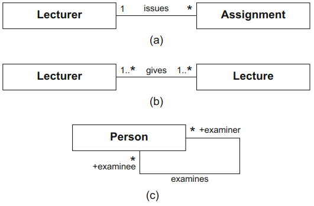
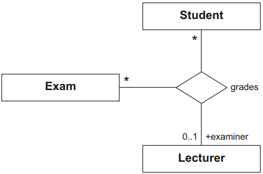
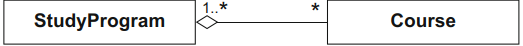
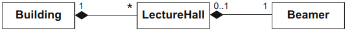

# Class Diagram
[^classroom]

We use the **class diagram** to model the static structure of a system, thus describing the elements of the system and the relationships between them. The class diagram is without doubt the most widely used UML diagram.

## Classes
A **class** is the construction plan for a set of similar objects that appear in the system to be specified. An **attribute** allows you to store information that is known for all instances but that generally has different specific values for each instance. **Operations** specify how specific behavior can be triggered on individual objects. To ensure that a model remains clear and understandable, we generally do not model all of the details of the content: we only include the information that is relevant for the moment and for the system to be implemented. This means that we **abstract** from reality to make the model less complex and to avoid an unnecessary flood of information.

In a class diagram, a class is represented by a rectangle that can be subdivided into multiple compartments:
- The first compartment must contain the name of the class, which generally begins with a capital letter and is positioned centered in bold font.
- The second compartment of the rectangle contains the attributes of the class.
- The third compartment of the rectangle contains the operations of the class.

The contents of these compartments are positioned left-justified and are optional. In general, the level of detail in these compartments reflects the respective phase of the software development process in which the class is being examined. If specific information is not included in the diagram, this does not mean that it does not exist; it simply means that this information is not relevant at this moment in time or is not included for practical reasons, for example, to prevent the diagram from becoming over-complicated.

The **visibility** of attributes and operations specifies who is and who is not permitted to access them:
- public (`+`): Access by objects of any classes permitted
- private (`-`): Access only within the object itself permitted
- protected (`#`): Access by objects of the same class and its subclasses permitted
- package (`~`): Access by objects whose classes are in the same package permitted

Visibilities are used to realize **information hiding**. Attributes and operations of classes that are marked as private are often omitted, as they are important for the realization, that is, the implementation of a class, but not for its use.

In contrast to instance variables, **class variables (class attributes, static attributes)** are created only once for a class rather than separately for every instance of this class. **Static operations (class operations)** can be used if no instance of the corresponding class was created. In the class diagram, static attributes and static operations are underlined.

## Attributes

You can specify additional **properties** of the attribute within curly brackets. For example, the property `{readOnly}` means that the attribute value cannot be changed once it has been initialized.

The specification of a forward slash before an attribute name indicates that the value of this **derived attribute** is derived from other attributes.

The **multiplicity** of an attribute indicates how many values an attribute can contain. The multiplicity is shown as an interval enclosed by square brackets in the form `[minimum..maximum]`. If there is no upper limit for the interval, this is expressed with an asterisk `∗`. If minimum and maximum are identical, you do not have to specify the minimum and the two dots.

## Operations

Operations are characterized by their name, their parameters, and the type of their return value. The class diagram is not suitable for describing the behavior of objects in detail as it only models signatures of the operations that the objects provide. UML offers special behavior diagrams for depicting the implementation of operations, for example the activity diagram.

If required, you can also prepend a direction to the parameter name. This direction can have one of the following values: `in`, `out`, or `inout`.

## Associations
**Associations** between classes model possible relationships, known as **links**, between instances of the classes. They describe which classes are potential communication partners.  class diagram can be viewed as a graph in which the classes represent the nodes and the associations represent the edges.

### Binary associations

A **binary association** allows us to associate the instances of two classes with one another. The edge can be labeled with the name of the association optionally followed by the reading direction, a small, black triangle. The reading direction is directed towards one end of the association and merely indicates in which direction the reader of the diagram should “read” the association name.

**Navigability** indicates that an object knows its partner objects and can therefore access their visible attributes and operations. If the edge is directed, navigation from an object to its partner object is possible. A non-navigable association end is indicated by the explicit specification of an `X` at the association end concerned. Bidirectional edges without arrowheads or X at their ends do not provide any information about the navigation direction but in practice, bidirectional navigability is usually assumed. The navigation direction has nothing to do with the reading direction.

You may also label the association ends with role names. A **role** describes the way in which an object is involved in an association relationship, that is, what role it plays in the relationship.

In the same way that multiplicities of attributes and parameters are specified, **multiplicities** of associations are given as an interval in the form `minimum..maximum`. They specify the number of objects that may be associated with exactly one object of the opposite side.

### N-ary associations

If more than two partner objects are involved in a relationship, you can model this using an **n-ary association**. There are no navigation directions for n-ary associations; however, multiplicities and role names are possible. Multiplicities define how many objects of a role/class may be assigned to a fixed $(n −1)$-tuple of objects of the other roles/classes.

## Aggregations
An **aggregation** is a special form of association that is used to express that instances of one class are parts of an instance of another class. UML differentiates between two types: shared aggregation and composition. Both are transitive and asymmetric associations.

A **shared aggregation** expresses a weak belonging of the parts to a whole, meaning that parts also exist independently of the whole. Shared aggregations can span a directed acyclic graph. A shared aggregation is differentiated from an association only by the fact that it explicitly visualizes a “part of” relationship.

The use of a **composition** expresses that a specific part can only be contained in at most one composite object at one specific point in time. This results in a maximum multiplicity of 1 at the aggregating end. The composite objects therefore form a forest of trees, indicating an existence dependency between the composite object and its parts; if the composite object is deleted, its parts are also deleted.

[^classroom]: UML @ Classroom: An Introduction to Object-Oriented Modeling