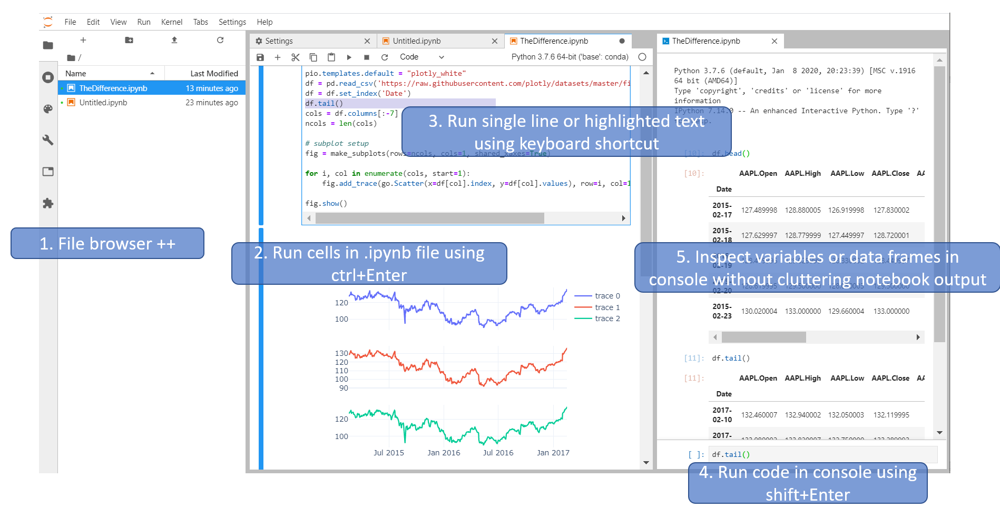

# [Jupyter](https://jupyter.org/)
[GitHub](https://github.com/jupyter/)

> Free software, open standards, and web services for interactive computing across all programming languages.

[Software Subprojects --- Project Jupyter Governance](https://jupyter.org/governance/software_subprojects.html)
- [List of Official Jupyter Subprojects --- Project Jupyter Governance](https://jupyter.org/governance/list_of_subprojects.html)

Applications:
- JupyterLab
- Jupyter Notebook
- Voilà

[Plug your application into the Jupyter world | by David Brochart | Jupyter Blog](https://blog.jupyter.org/plug-your-application-into-the-jupyter-world-805e48918801)

## [Kernels](https://github.com/jupyter/jupyter/wiki/Jupyter-kernels)
Interpreted languages:
- Python: IPython
- Ruby
- R
- Julia
- [JavaScript](JS/README.md)
- [TypeScript](JS/README.md)
- PowerShell
- Bash

Compiled languages:
- [C++](C++/README.md)
- Rust
- Go
- C#
- Java
- Kotlin

Other languages:
- SQL

## Jupyter Notebook
相比传统的 file 模式，Notebook 的优势是：
- 可以嵌入 Markdown 文档
- 运行代码更为轻松  
  不需要命令行，不需要快捷键，只需要点一下
- 可以即时从运行结果得到反馈，减少了代码的不确定性，开发心智负担更低
- 运行结果与代码位置耦合，减少了组织成本
- 可以便捷地输出富媒体结果

相比 REPL 模式，Notebook 的优势是：
- 可以嵌入 Markdown 文档
- 代码可复用
- 编辑代码块更为方便
- 可以便捷地输出富媒体结果

Notebook 可以理解为 file 与 REPL 的中间体。

基于这些特性，Notebook 更适用于：
- 编写不确定性较高的代码
  - 学习编程语言
  - Prototype development
  - Proof of concept
  - 探索结果
    - 数据分析
- 编写含有代码的文档
  - 编程语言教程/笔记
- 编写需要将代码输出作为内容的文档
  - 论文

Libraries:
- [papermill: 📚 Parameterize, execute, and analyze notebooks](https://github.com/nteract/papermill/)
  - Ploomber

### CLI
Executing:
- `jupyter execute notebook.ipynb`
  - `print()` is not printed

    `jupyter execute "Programming\Jupyter\print.ipynb"`

  ```sh
  An application used to execute notebook files (*.ipynb)

  Options
  =======
  The options below are convenience aliases to configurable class-options,
  as listed in the "Equivalent to" description-line of the aliases.
  To see all configurable class-options for some <cmd>, use:
      <cmd> --help-all

  --allow-errors
      Errors are ignored and execution is continued until the end of the notebook.
      Equivalent to: [--NbClientApp.allow_errors=True]
  --timeout=<Int>
      The time to wait (in seconds) for output from executions. If a cell
      execution takes longer, a TimeoutError is raised. ``-1`` will disable the
      timeout.
      Default: None
      Equivalent to: [--NbClientApp.timeout]
  --startup_timeout=<Int>
      The time to wait (in seconds) for the kernel to start. If kernel startup
      takes longer, a RuntimeError is raised.
      Default: 60
      Equivalent to: [--NbClientApp.startup_timeout]
  --kernel_name=<Unicode>
      Name of kernel to use to execute the cells. If not set, use the kernel_spec
      embedded in the notebook.
      Default: ''
      Equivalent to: [--NbClientApp.kernel_name]

  To see all available configurables, use `--help-all`.
  ```
  [Running the Notebook --- Jupyter Documentation 4.1.1 alpha documentation](https://docs.jupyter.org/en/latest/running.html#using-a-command-line-interface)

- `ipython -c "%run <notebook>.ipynb"`
  - `print()` is printed
- `ipython --TerminalIPythonApp.file_to_run=<notebook>.ipynb`

[Three Tools for Executing Jupyter Notebooks](https://ploomber.io/blog/notebook-execution/)

## JupyterLab


相比 Notebook 而言多了文件树、终端和调试器。

[Jupyter Notebook or Lab or VS Code? Why not all?](https://github.com/Createdd/Writing/blob/master/2021/articles/jupyterNbOrLab.md)