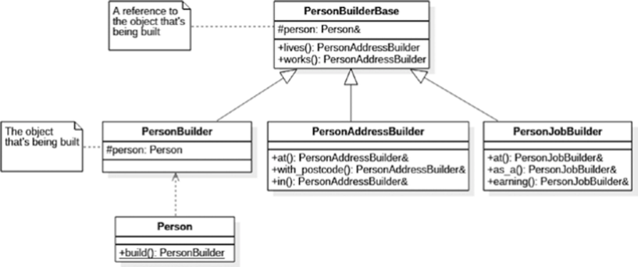

# Builder
## Fluent builder
链式调用
```cpp
HtmlBuilder& add_child(string child_name, string child_text)
{
  HtmlElement e{ child_name, child_text };
  root.elements.emplace_back(e);
  return *this;
}
```
```cpp
HtmlBuilder builder{ "ul" };
builder.add_child("li", "hello").add_child("li", "world");
cout << builder.str() << endl;
```

## Communication intent
禁止直接构造类，让用户发觉需要使用 Builder。
```cpp
HtmlElement e = HtmlElement::build("ul")
  .add_child("li", "hello")
  .add_child("li", "world");
cout << e.str() << endl;
```

## Groovy-style builder
利用统一初始化和 `initializer_list`。
```cpp
std::cout <<
  P {
    IMG { "http://pokemon.com/pikachu.png" }
  }
  << std::endl;
```

## Composite builder

```cpp
Person p = Person::create()
  .lives().at("123 London Road")
          .with_postcode("SW1 1GB")
          .in("London")
  .works().at("PragmaSoft")
          .as_a("Consultant")
          .earning(10e6);
```