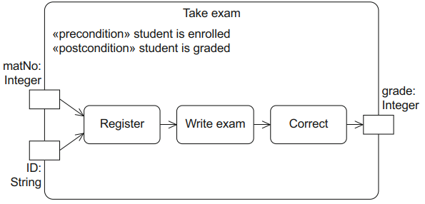
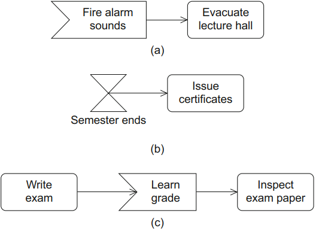
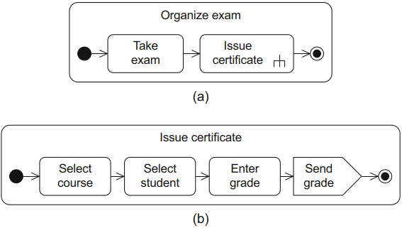
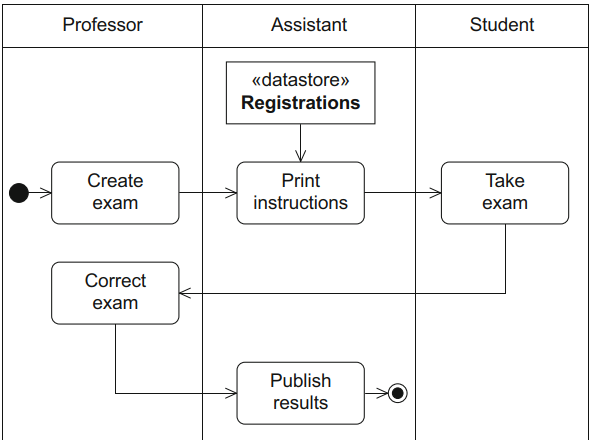

# Activity Diagram
[^classroom]

The **activity diagram** focuses on modeling procedural processing aspects of a system. An activity diagram allows you to specify user-defined behavior in the form of **activities**. It specifies the control flow and data flow between various steps—the **actions**—required to implement an activity.

The UML standard does not stipulate any specific form of notation for activities. In addition to the flow-based notation elements of the activity diagrams, the standard also allows other forms of notation, such as structural diagrams or even pseudocode.

## Activities
An **activity** itself can describe the implementation of a use case. At a very detailed level, it can also define the behavior of an operation in the form of individual instructions, or at a less detailed level, model the functions of a business process.

The content of an activity is a directed graph whose nodes represent the components of the activity like actions, data stores, and control elements and whose edges represent the control flow or object flow, that is, the possible execution paths for the activity.

**Control flow edges** only define the order between actions, whereas **object flow edges** can also be used to exchange data or objects.

You can specify **preconditions** and **postconditions** for an activity. These indicate which conditions have to be fulfilled before or after the activity is executed.

## Actions
The basic elements of activities are **actions**. You can use actions to specify any user-defined behavior. Within the context of an activity, actions cannot be broken down further. However, an action can refer to another activity that itself consists of actions.

In UML, there are a number of predefined, non-language-specific actions that you can model easily in any target language due to their level of detail.

### Event-based actions
**Event-based actions** enable objects and signals to be transmitted to receiver objects. You can use an **accept event action** to model an action that waits for the occurrence of a specific event. If the event is a time-based event, you can use an **accept time event action**.

To send signals, you can use **send signal actions**.

### Call behavior actions
**Call behavior actions** can call activities themselves.

An action can also trigger the call of an operation. This type of action is referred to as a **call operation action**.

## Partitions
A **partition** allows you to group nodes and edges of an activity based on  common properties. Generally, partitions reflect organizational units or roles that are responsible for the execution of the actions within the partitions.

[^classroom]: UML @ Classroom: An Introduction to Object-Oriented Modeling