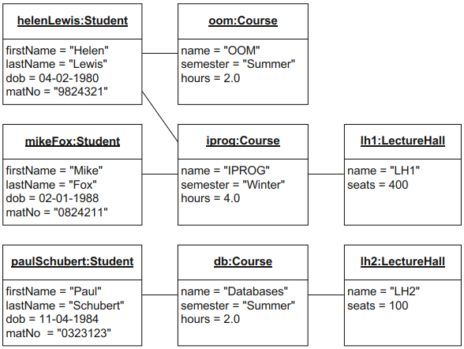

# Object Diagram
[^classroom]

**Object diagrams** allow you to depict concrete objects that appear in a system at
a specific point in time. The object diagram visualizes instances of classes that are modeled in a class diagram. If specific objects are not represented in the object diagram, this does not mean that they do not exist; it merely expresses that the unrecorded objects are not important for the moment.

The characteristics of an object include its **structural characteristics (attributes)** and its **behavior (operations)**. Whilst concrete values are assigned to the attributes in the object diagram, operations are generally not depicted.

In the object diagram, an object is shown as a rectangle which can be subdivided into multiple compartments:
- The first compartment always contains information in the form `objectName:Class`. If the object name is omitted, this object is referred to as an **anonymous object**.
- If the rectangle has a second compartment, this compartment contains the attributes of the object and the current values of these attributes.

The relationships between the objects are referred to as **links**.

[^classroom]: UML @ Classroom: An Introduction to Object-Oriented Modeling