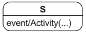

# State Machine Diagram
[^classroom]

Using a **state machine diagram**, you can model the possible states for the system or object in question, how state transitions occur as a consequence of occurring events, and what behavior the system or object exhibits in each state. UML differentiates between two types of state machines, namely **behavior state machines** and **protocol state machines**.

## States

A state machine diagram is a graph with **states** as nodes and **state transitions** as edges. In the diagram, a state is shown as a rectangle with round corners and is labeled with the name of the state.

When an object is in a specific state, all **internal activities** specified in this state can be executed by this object. Within a state you can model three activities that are executed at a predefined moment:
- entry: executed when the object enters the state
- do: executed while the object remains in this state
- exit: executed when the object exits the state

The respective activity is always specified with a prepended forward slash that clearly identifies it as an activity.

**Pseudostates** are transient states, which means that the system cannot transient in a pseudostate. These pseudostates include:
- Initial state

  

  The initial state has no incoming edges and usually one outgoing edge which leads to the first “real” state.
- Decision node

  

  Decision node is used to model alternative transitions. At the incoming edge, you model the event that triggers the transition; at the outgoing edges, you specify the guards for the alternative paths for the state transition.
- Parallelization and synchronization nodes

  

  The parallelization node has exactly one incoming edge and at least two outgoing edges and is used to split the flow into multiple concurrent transitions. The synchronization node has at least two incoming edges and exactly one outgoing edge and is used to merge multiple concurrent flows.
- History state
- Entry and exit points
- Terminate node

  

  If a terminate node is reached in a flow, the state machine terminates and the modeled object ceases to exist.

The only other “real” state is the **final state**. It marks the end of the sequence of states. The object can remain in a final state permanently.

## Events
UML defines various types of events, with the most important being:
- Signal event: `event name(arg1, arg2)`

  The signal event is used for asynchronous communication. The receiver is the modeled object and the sender can be another object or the same object as the receiver. The name of the event corresponds to that of the signal and arguments can be specified.
- Call event: `opName(part,par2)`

  Call events are operation calls. The name of the event corresponds to the name of an operation including parameters.
- Time event: `after(period)`, `when(time)`

  Time events enable time-based state transitions.
- Change event: `when(boolExpr)`

  You can use a change event to permanently monitor whether a condition becomes true.
- Any receive event: `all`

  You can use an any receive event to specify a type of “else” transition.
- Completion event

  A completion event takes place when everything to be done in the current state is completed. If a state has an outgoing transition without any event specified, the completion event triggers this transition.

## State transitions
The change from one state to another is referred to as a **state transition**.

A transition is represented with a directed edge, that is, an arrow. The origin of the transition is referred to as the **source state** and the end of the transition is referred to as the **target state**.

You can specify various properties for a transition:
- The event (also called “trigger”) that triggers the state transition from outside the system/object
- The guard (also called “guard condition” or simply “condition”) that enables the execution of the transition
- Activities (also called “effects”) executed during the change to the target state

**Internal transitions** represent the reaction to an event that triggers an activity but not a state transition. They handle the occurrence of events within a state.

## Composite states

A **composite state (complex state, nested state)** is a state that contains multiple other states as well as pseudostates. The states contained within a composite state are referred to as its **substates**.

[^classroom]: UML @ Classroom: An Introduction to Object-Oriented Modeling