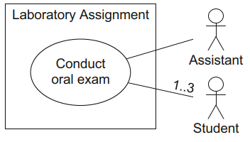

# Use Case Diagram
[^classroom]

The **use case diagram** allows us to describe the possible usage scenarios (use cases) that a system is developed for. A **use case** describes functionality expected from the system to be developed. In general, a use case is triggered either by invocation of an **actor** or by a **trigger event**, in short, a trigger. An actor is always clearly outside the system, i.e., a user is never part of the system and is therefore never implemented.

## Use cases

A use case is usually represented as an ellipse. The name of the use case is specified directly in or directly beneath the ellipse. Alternatively, a use case can be represented by a rectangle that contains the name of the use case in the center and a small ellipse in the top right-hand corner.

The set of all use cases together describes the functionality that a software system provides. The use cases are generally grouped within a rectangle.

## Actors
Actors do not represent a specific user—they represent **roles** that users adopt. Specific users can adopt and set aside multiple roles simultaneously.

In the use case diagram, actors always interact with the system in the context of their use cases, that is, the use cases with which they are associated. Actors are represented by stick figures, rectangles (containing the additional information `«actor»`), or by a freely definable symbol.

An actor interacts with the system by using the system as an **active actor**, meaning that the actor initiates the execution of use cases; alternatively, the interaction involves the actor being used by the system, meaning that the actor is a **passive actor** providing functionality for the execution of use cases.

Furthermore, use case diagrams can also contain both primary and secondary actors. A **primary actor** takes an actual benefit from the execution of the use case, whereas the the **secondary actor** receives no direct benefit from the execution of the use case.

## Associations

An actor is connected with the use cases via **associations** which express that the actor communicates with the system and uses a certain functionality. **Multiplicities** may be specified
for the association ends.

## Relationships between actors

Actors often have common properties and some use cases can be used by various actors. To express this, actors may be depicted in an **inheritance relationship (generalization)** with one another. When an actor Y (sub-actor) inherits from an actor X (super-actor), Y is involved with all use cases with which X is involved. It is represented with a line from the sub-actor to the super-actor with a large triangular arrowhead at the super-actor end.

If there is no instance of an actor, this actor can be labeled with the keyword `{abstract}`. Alternatively, the names of abstract actors can be represented in italic font.

Generalization is a fundamental concept of object orientation and can be applied to many different language elements of UML.

## Relationships between use cases
Use cases can also be in a relationship with other use cases.

If a use case A includes a use case B, represented as a dashed arrow from A to B labeled with the keyword `«include»`, the behavior of B is integrated into the behavior of A. Here, A is referred to as the **base use case** and B as the **included use case**. The use of `«include»` is analogous to calling a subroutine in a procedural programming language.

If a use case B is in an `«extend»` relationship with a use case A, then A can use the behavior of B but does not have to. Here, A is again referred to as the **base use case** and B as the **extending use
case**. An `«extend»` relationship is shown with a dashed arrow from the extending use case B to the base use case A. Note that the arrow indicating an `«extend»` relationship points towards the base use case, whereas the arrow indicating an `«include»` relationship originates from the base use case and points towards the included use case.

A **condition** that must be fulfilled for the base use case to insert the behavior of the extending use case can be specified for every` «extend»` relationship. The condition is specified, within curly brackets, in a note that is connected with the corresponding `«extend»` relationship. By using **extension points**, you can define the point at which the behavior of the extending use cases must be inserted in the base use case.

In the same way as for actors, **generalization** is also possible between use cases. Thus, common properties and common behavior of different use cases can be grouped in a parent use case. If a use case A generalizes a use case B, B inherits the behavior of A, which B can either extend or overwrite. Then, B also inherits all relationships from A. Therefore, B adopts the basic functionality of A but decides itself what part of A is executed or changed.

[^classroom]: UML @ Classroom: An Introduction to Object-Oriented Modeling